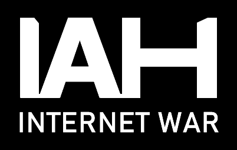

   

IAH: INTERNET WAR is a unique and strategic turn-based RTS where you immerse yourself in an endless internet conflict. In this game, you'll embark on a thrilling journey to capture internet websites, eliminate malware, battle powerful corporations, resist government authorities, and outwit rival hackers.

For programmers seeking a competitive challenge, IAH offers algorithmic multiplayer. In this mode, you cannot use a cursor or controller; your interactions are limited to the API Interface. Create or join competitive clubs, write code solo or collaborate in a group, and use your preferred IDE and programming language to wage highly competitive algorithmic wars.

 

IAH: INTERNET WAR Steam Page: **https://store.steampowered.com/app/304770/IAH_INTERNET_WAR/**

Main Website: **https://iamhacker.cc/**

Online API Documentation: **https://iamhacker.cc/documentation**

Singleplayer API Documentation **[https://github.com/VitaliKirpu/IAH_SinglePlayerAITemplate/wiki](https://github.com/VitaliKirpu/IAH_SinglePlayerAITemplate/wiki/IAH:-INTERNET-WAR-%7C-SINGLEPLAYER-AI-API)**

 

### Quick Start Guide

1. Obtain the API Key from the Main Website and paste your own here: https://github.com/VitaliKirpu/IAH_SinglePlayerAITemplate/blob/d4f815aa17dfa7a4105e00e24e6ca40ed7c67f33/IAH_SinglePlayerAutomation/Requests.cs#L34
2. Launch IAH: INTERNET WAR Game. Default AI Port is 6800, but you can change this with -apiPort 6900 launch parameter
3. Launch this Example API Template Project; automation should occur now. From the main menu, the AI will navigate the UI, select Hacker, enter the game, perform all necessary actions, create units, and battle enemies if they are present.

### Testing before buying API Key?

This sample code will partially work without an API Key. All menu functions will work, but you won't be able to control your actual units.

### Troubleshooting
- AI Template Crashes on Launch, or nothing happens. -> Make sure to do port forwarding and ensure the game runs. https://github.com/VitaliKirpu/IAH_SinglePlayerAITemplate/blob/d4f815aa17dfa7a4105e00e24e6ca40ed7c67f33/IAH_SinglePlayerAutomation/Program.cs#L31

### TODO
- Add Support for Multiplayer Co-Op.
- Add Support for Invading Other Players.
